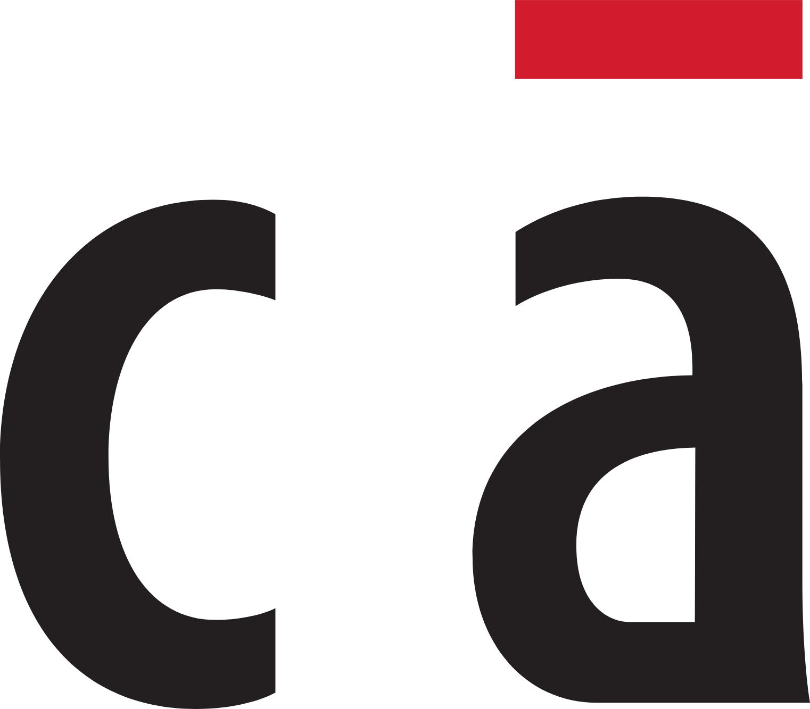
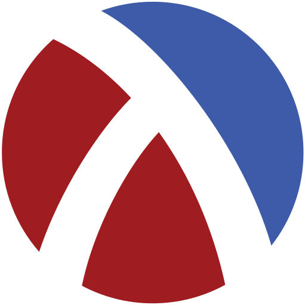
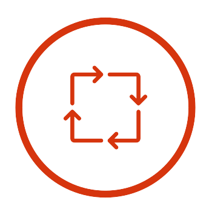
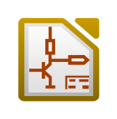

## I'm Adrian Tuschek 👋, 

- An Electrical Engineering & Computer Engineering Student at The University of California - Irvine 
- Born and raised in the **🌲Pacific Northwest🌲** but currently in California

&nbsp;&nbsp;
  
&nbsp;&nbsp;
  
&nbsp;&nbsp;

---

### Languages and Tools:
<code></code>
<code></code>
<code></code>
<code></code>
<code></code>
<code></code>
<code></code>
<code></code>
<code></code>
<code></code>
<code></code>
<code></code>
<code></code>

---
### Engineering Languages & Tools
<code></code>
<code></code>
<code></code>
<code></code>
<code></code>
<code></code>
<code></code>
<code></code>
<code></code>
<code></code>
<code></code>
<code></code>

---

